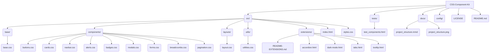
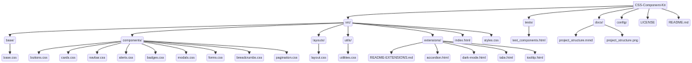

# CSS Component Kit


## Português

Kit completo de componentes UI reutilizáveis implementados com CSS3 puro, incluindo botões, cards, modais, navegação e outros elementos essenciais para desenvolvimento web moderno.

### 🎯 Demonstração

Este projeto oferece uma biblioteca de componentes prontos para uso, facilitando o desenvolvimento de interfaces web consistentes e profissionais.
Acesse a demonstração interativa em [GitHub Pages](https://galafis.github.io/CSS-Component-Kit/) para ver todos os componentes em ação!

### ✨ Características

- **Componentes Modulares**: Elementos reutilizáveis e independentes
- **Design System**: Consistência visual em todos os componentes
- **CSS Puro**: Sem dependências JavaScript
- **Customizável**: Fácil personalização via CSS Variables
- **Responsivo**: Todos os componentes adaptáveis
- **Extensões**: Componentes avançados na pasta `src/extensions/`

### 🛠️ Tecnologias

Este projeto é construído com as seguintes tecnologias:

- **HTML5**: Utilizado para a estruturação semântica de todos os componentes e páginas de demonstração.
- **CSS3**: A base de todo o kit, empregando recursos modernos como Flexbox, Grid Layout, Custom Properties (variáveis CSS) para um design responsivo e modular.
- **CSS Variables**: Essenciais para o sistema de design, permitindo fácil personalização de cores, espaçamentos e tipografia.
- **Mermaid**: Utilizado para gerar diagramas de arquitetura e estrutura do projeto diretamente do código Markdown.
- **GitHub Pages**: Plataforma de hospedagem estática para a demonstração interativa dos componentes.

### 📁 Estrutura do Projeto






### ✅ Testes e Validação

Para garantir a funcionalidade e a integridade dos componentes, o projeto inclui uma suíte de testes visuais. Você pode acessá-los abrindo o arquivo `tests/test_components.html` diretamente no seu navegador. Este arquivo demonstra a renderização e o comportamento esperado de cada componente após a refatoração e garante que todas as melhorias foram aplicadas corretamente.

### 🚀 Como Usar

#### Instalação

**1.** Clone o repositório:

```bash
git clone https://github.com/galafis/CSS-Component-Kit.git
cd CSS-Component-Kit
```


#### Uso dos Componentes

```html
<button class="btn btn-primary">Primary Button</button>
<div class="card">
  <div class="card-header">
    <h3>Card Title</h3>
  </div>
  <div class="card-body">
    <p>Card content goes here...</p>
  </div>
</div>
<nav class="navbar">
  <div class="navbar-brand">Brand</div>
  <ul class="navbar-nav">
    <li class="nav-item"><a href="#" class="nav-link">Home</a></li>
  </ul>
</nav>
```

### 🧩 Componentes Disponíveis

- **Layout**: Container, Flexbox Utilities, Grid System, Spacing
- **Navegação**: Navbar, Breadcrumb, Pagination
- **Conteúdo**: Cards, Modals, Alerts, Badges
- **Formulários**: Form Controls, Form Groups, Validation
- **Utilitários**: Typography, Colors, Shadows, Borders

### 🎨 Sistema de Design

#### Cores

```css
:root {
    --primary: #667eea;
    --secondary: #764ba2;
    --success: #28a745;
    --warning: #ffc107;
    --danger: #dc3545;
    --info: #17a2b8;
    --light: #f8f9fa;
    --dark: #343a40;
}
```

#### Espaçamentos

```css
:root {
    --spacing-xs: 4px;
    --spacing-sm: 8px;
    --spacing-md: 16px;
    --spacing-lg: 24px;
    --spacing-xl: 32px;
}
```

#### Tipografia

```css
:root {
    --font-size-sm: 14px;
    --font-size-base: 16px;
    --font-size-lg: 18px;
    --font-size-xl: 24px;
    --font-size-xxl: 32px;
}
```

### 📱 Responsividade

Todos os componentes incluem breakpoints responsivos:

```css
/* Mobile: 320px - 767px */
/* Tablet: 768px - 1023px */
/* Desktop: 1024px+ */
```

O sistema de grid se adapta automaticamente:
- **Mobile**: Todas as colunas empilham (1 coluna)
- **Tablet**: Grid-3 e Grid-4 se tornam 2 colunas
- **Desktop**: Todas as grids mantêm suas colunas originais

### 🔧 Personalização

Customize facilmente modificando as variáveis CSS:

```css
:root {
    --primary-color: #your-color;
    --border-radius: 12px;
    --box-shadow: 0 4px 6px rgba(0, 0, 0, 0.1);
}
```

### 🎁 Extensões Disponíveis

Na pasta `src/extensions/` você encontra componentes avançados:

- **Tabs (Abas)**: Sistema de abas puro CSS usando radio buttons e `:checked`
- **Accordion (Acordeão)**: Acordeão expansível usando checkboxes
- **Tooltips**: Tooltips com múltiplas posições (top, right, bottom, left)
- **Dark Mode (Modo Escuro)**: Modo escuro 100% CSS puro com toggle switch interativo

Para mais detalhes, consulte `src/extensions/README-EXTENSIONS.md`

### 🔧 Extensões Futuras

- [ ] Animações e transições avançadas
- [ ] Componentes de data/calendar
- [ ] Charts e gráficos CSS
- [ ] Integração com frameworks JavaScript
- [ ] Sistema de temas customizáveis
- [ ] Mais variações de dark mode

### 🤝 Contribuindo

Contribuições são bem-vindas! Para adicionar novos componentes:

1. Fork o projeto
2. Crie uma branch para seu componente (`git checkout -b feature/NovoComponente`)
3. Commit suas mudanças (`git commit -m 'Adiciona novo componente'`)
4. Push para a branch (`git push origin feature/NovoComponente`)
5. Abra um Pull Request

### 📄 Licença

Este projeto está licenciado sob a Licença MIT - veja o arquivo [LICENSE](LICENSE) para detalhes.

### 👨‍💻 Autor

**Gabriel Demetrios Lafis**

- GitHub: [@galafis](https://github.com/galafis)
- Email: gabrieldemetrios@gmail.com

---

⭐ Se este projeto foi útil, considere deixar uma estrela!

*Desenvolvido com 💜 e CSS3 puro por Gabriel Demetrios Lafis*

## English

Complete kit of reusable UI components implemented with pure CSS3, including buttons, cards, modals, navigation, and other essential elements for modern web development.

### 🎯 Demo

This project offers a library of ready-to-use components, facilitating the development of consistent and professional web interfaces.
Access the interactive demo on [GitHub Pages](https://galafis.github.io/CSS-Component-Kit/) to see all components in action!

### ✨ Features

- **Modular Components**: Reusable and independent elements
- **Design System**: Visual consistency across all components
- **Pure CSS**: No JavaScript dependencies
- **Customizable**: Easy customization via CSS Variables
- **Responsive**: All components are adaptable
- **Extensions**: Advanced components in the `src/extensions/` folder

### 🛠️ Technologies

This project is built with the following technologies:

- **HTML5**: Used for the semantic structuring of all components and demo pages.
- **CSS3**: The foundation of the entire kit, employing modern features like Flexbox, Grid Layout, and Custom Properties (CSS variables) for responsive and modular design.
- **CSS Variables**: Essential for the design system, allowing easy customization of colors, spacing, and typography.
- **Mermaid**: Used to generate architecture and project structure diagrams directly from Markdown code.
- **GitHub Pages**: Static hosting platform for the interactive demonstration of components.

### 📁 Project Structure


### ✅ Tests and Validation

To ensure the functionality and integrity of the components, the project includes a suite of visual tests. You can access them by opening the `tests/test_components.html` file directly in your browser. This file demonstrates the rendering and expected behavior of each component after refactoring and ensures that all improvements have been correctly applied.

### 🚀 How to Use

#### Installation

**1.** Clone the repository:

```bash
git clone https://github.com/galafis/CSS-Component-Kit.git
cd CSS-Component-Kit
```


#### Component Usage

```html
<button class="btn btn-primary">Primary Button</button>
<div class="card">
  <div class="card-header">
    <h3>Card Title</h3>
  </div>
  <div class="card-body">
    <p>Card content goes here...</p>
  </div>
</div>
<nav class="navbar">
  <div class="navbar-brand">Brand</div>
  <ul class="navbar-nav">
    <li class="nav-item"><a href="#" class="nav-link">Home</a></li>
  </ul>
</nav>
```

### 🧩 Available Components

- **Layout**: Container, Flexbox Utilities, Grid System, Spacing
- **Navigation**: Navbar, Breadcrumb, Pagination
- **Content**: Cards, Modals, Alerts, Badges
- **Forms**: Form Controls, Form Groups, Validation
- **Utilities**: Typography, Colors, Shadows, Borders

### 🎨 Design System

#### Colors

```css
:root {
    --primary: #667eea;
    --secondary: #764ba2;
    --success: #28a745;
    --warning: #ffc107;
    --danger: #dc3545;
    --info: #17a2b8;
    --light: #f8f9fa;
    --dark: #343a40;
}
```

#### Spacing

```css
:root {
    --spacing-xs: 4px;
    --spacing-sm: 8px;
    --spacing-md: 16px;
    --spacing-lg: 24px;
    --spacing-xl: 32px;
}
```

#### Typography

```css
:root {
    --font-size-sm: 14px;
    --font-size-base: 16px;
    --font-size-lg: 18px;
    --font-size-xl: 24px;
    --font-size-xxl: 32px;
}
```

### 📱 Responsiveness

All components include responsive breakpoints:

```css
/* Mobile: 320px - 767px */
/* Tablet: 768px - 1023px */
/* Desktop: 1024px+ */
```

The grid system automatically adapts:
- **Mobile**: All columns stack (1 column)
- **Tablet**: Grid-3 and Grid-4 become 2 columns
- **Desktop**: All grids maintain their original columns

### 🔧 Customization

Easily customize by modifying CSS variables:

```css
:root {
    --primary-color: #your-color;
    --border-radius: 12px;
    --box-shadow: 0 4px 6px rgba(0, 0, 0, 0.1);
}
```

### 🎁 Available Extensions

In the `src/extensions/` folder, you will find advanced components:

- **Tabs**: Pure CSS tab system using radio buttons and `:checked`
- **Accordion**: Expandable accordion using checkboxes
- **Tooltips**: Tooltips with multiple positions (top, right, bottom, left)
- **Dark Mode**: 100% pure CSS dark mode with interactive toggle switch

For more details, consult `src/extensions/README-EXTENSIONS.md`

### 🔧 Future Extensions

- [ ] Advanced animations and transitions
- [ ] Date/calendar components
- [ ] CSS charts and graphs
- [ ] Integration with JavaScript frameworks
- [ ] Customizable theme system
- [ ] More dark mode variations

### 🤝 Contributing

Contributions are welcome! To add new components:

1. Fork the project
2. Create a branch for your component (`git checkout -b feature/NewComponent`)
3. Commit your changes (`git commit -m 'Add new component'`)
4. Push to the branch (`git push origin feature/NewComponent`)
5. Open a Pull Request

### 📄 License

This project is licensed under the MIT License - see the [LICENSE](LICENSE) file for details.

### 👨‍💻 Author

**Gabriel Demetrios Lafis**

- GitHub: [@galafis](https://github.com/galafis)
- Email: gabrieldemetrios@gmail.com

---

⭐ If this project was helpful, consider leaving a star!

*Developed with 💜 and pure CSS3 by Gabriel Demetrios Lafis*
